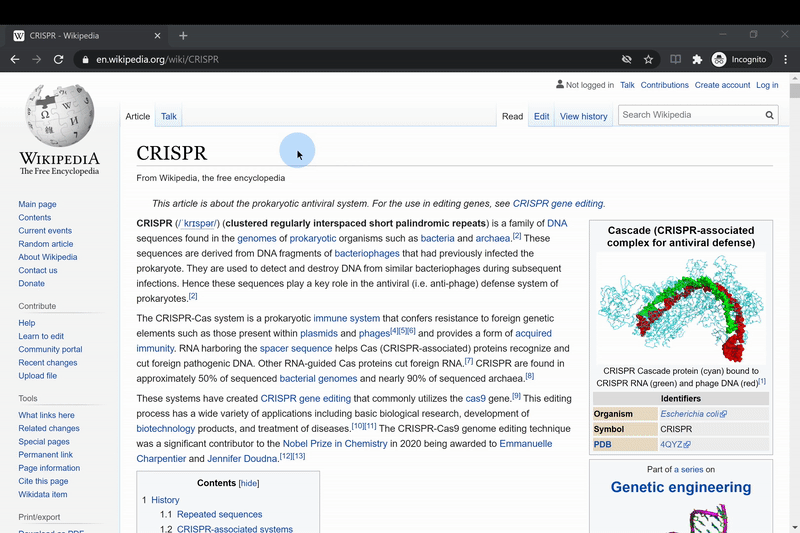

# Lookupper
This is a chrome extension, which adds a functionality to look up a word definition quickly. For now, it only supports [Oxford Learner's Dictionaries](https://www.oxfordlearnersdictionaries.com/).

## Features
- The extension immediately takes effect when you load it to Chrome.
- To look up:
    - Double click a word.
    - Highlight a word, right click, select 'Look up ~'.
- Automatically plays the pronunciation when a word is looked up.
- The popup window will be reused next time you look up, so you can resize and reposition however you want.

## Acknowledements
[Extension API](https://developer.chrome.com/extensions) provided by Google uses callbacks instead of Promises. To prevent callback hell, this extension uses [chromeExtensionAsync liblary](https://github.com/KeithHenry/chromeExtensionAsync), which makes Extension API able to handle Promises. It helped a lot to improve maintainability of the code.

- This extenison's icon has been taken from https://github.com/feathericons/feather.
